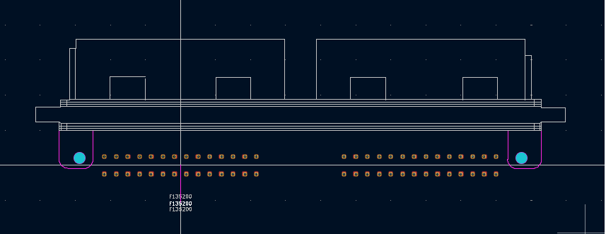

# Delphi-APTIV-F135200-footprint-for-Kicad
Delphi/APTIV F135200 footprint for Kicad

should also be compatible with 211PL562L0011

NOTE: Still haven't tested it on an actual PCB, use it at your own risk :P

Here you can find the KiCad footprint for the F135200 connector.

I had to create it myself since I couldn't find one available online, so I thought it might be useful to others as well.

This connector is particularly interesting for standalone ECU projects, since a compatible version of the case is available on AliExpress.

I'm currently working on a uaEFI using this case, but I'm still missing the exact mechanical drawing of the 56-pin ECU case available on AliExpress.

If you have the mechanical drawing, have worked on something similar, or simply want to help develop this project, feel free to contribute or get in touch.

Contributions are welcome! Whether it's hardware design, PCB layout, firmware, measurements, mechanical drawings, testing, or documentation, any help is appreciated.
